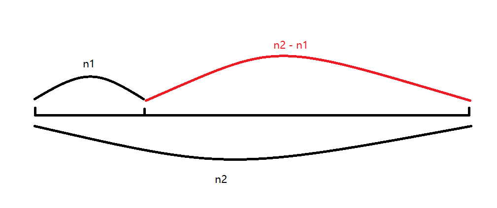

# 技巧与方法

## 01 交换两变量的值

#### 方法一：使用第三变量交换

```C
#include<stdio.h>

int main()
{
    int n1 = 5, n2 = 20;   // 需要交换的变量
    int temp;   // 用于交换的临时变量

    printf("交换前： n1 = %d, n2 = %d\n", n1, n2);

    // 交换过程
    temp = n1;
    n1 = n2;
    n2 = temp;

    printf("交换后： n1 = %d, n2 = %d\n", n1, n2);

    return 0;
}
```


#### 方法二：数轴法

```C
#include<stdio.h>

int main()
{
    int n1 = 5, n2 = 20;   // 需要交换的变量

    printf("交换前： n1 = %d, n2 = %d\n", n1, n2);

    // 交换过程
    n1 = n2 - n1;
    n2 = n2 - n1;
    n1 = n1 + n2;


    printf("交换后： n1 = %d, n2 = %d\n", n1, n2);

    return 0;
}
```




> 解析：
>
> 如图，n2 减去 n1可以的到两变量的差值，n2 减去差值就可以的到 n1 的值， n1的值加上差值就是 n2


#### 方法三：使用位操作符进行交换

```C
#define _CRT_SECURE_NO_WARNINGS
#include<stdio.h>

int main()
{
    int n1 = 5, n2 = 20;   // 需要交换的变量

    printf("交换前： n1 = %d, n2 = %d\n", n1, n2);

    // 交换过程
    n1 = n2 ^ n1;
    n2 = n2 ^ n1;
    n1 = n1 ^ n2;


    printf("交换后： n1 = %d, n2 = %d\n", n1, n2);

    return 0;
}
```

> 解析：
>
> n1 ^ (n1 ^ n2) = n2


## 02 最大公约数与最小公倍数

### 1. 最大公约数

#### 方法一：暴力求解

```C
#include<stdio.h>

int main()
{
    int n1 = 200, n2 = 300;
    int ret = n1 < n2 ? n1 : n2;

    while (ret > 0)
    {
        if (n1 % ret == 0 && n2 % ret == 0)
            break;

        ret--;
    }

    printf("最大公约数为: %d\n", ret);

    return 0;
}
```

> 解析：
>
> 从两个数中的较小值，开始递减，直到遇到能够同时整除两数的值。


#### 方法二：更相减损法

```C
#include<stdio.h>

int main()
{
    int n1 = 200, n2 = 300;
    int ret = 0;

    while (n2 != n1)
    {
        if (n1 < n2)
            n2 = n2 - n1;
        else
            n1 = n1 - n2;
    }

    ret = n1;

    printf("最大公约数为: %d\n", ret);

    return 0;
}
```

> 解析：
>
> 较大的值减去较小的值得到两数的差值，再用差值减去较小值，直到差值与较小的值相同时，这个值就是最大公约数


#### 方法三：辗转相除法

```c
#include<stdio.h>

int main()
{
    int n1 = 200, n2 = 300;
    int ret = 0;

    while (n2)
    {
        ret = n1 % n2;
        n1 = n2;
        n2 = ret;
    }

    ret = n1;
    printf("最大公约数为: %d\n", n1);

    return 0;
}
```

> 解析：
>
> 两个数的最大公约数等于 较小数 与 这两个数的余数 的最大公约数


### 2. 最小公倍数

#### 方法一：暴力求解

```c
#include<stdio.h>

int main()
{
    int n1 = 200, n2 = 300;
    int ret = n1 > n2 ? n1 : n2;

    while (ret <= (n1 * n2))
    {
        if (ret % n1 == 0 && ret % n2 == 0)
            break;

        ret++;
    }

    printf("最小公倍数为: %d\n", ret);

    return 0;
}
```


#### 方法二：公式法

```C
#include<stdio.h>

int main()
{
    int n1 = 200, n2 = 300;
    int gcd = 100;  // 最大公约数
    int ret = n1 * n2;


    ret = ret / gcd;

    printf("最小公倍数为: %d\n", ret);

    return 0;
}
```

> 解析：
>
> 两个数的乘积等于 最大公约数与最小公倍数的乘积
