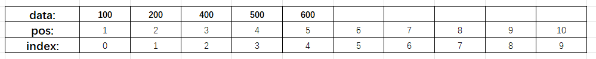

# 顺序表（Sequence table）

## 顺序表的定义

顺序表是用顺序存储方式存放的线性表（可以理解为数组的存储方式），表中的元素在内存中彼此相邻。

- 静态存储：在定义时就确定了顺序表的大小，并且之后顺序表的大小不会改变（即使之后空间不够用了，也无法增加）
- 动态存储：线性表的大小可以根据需要更改（顺序表满了，可以增加顺序表的大小）


## 基本操作

### 0. 基本的定义

**说明**：定义的顺序表是动态存储的，静态的基本操作也是一样的，只是没有增加空间的操作

```c
#include<stdio.h>
#include<stdlib.h>
#define INITSIZE 10	// 初始顺序表可以存放的最大元素个数

#define ERROR 0     //执行遇到错误
#define OK 1    	//成功执行
typedef int status;     // 返回的状态，1表示成功，0表示错误

// 顺序表的定义
typedef struct {	
    int *data;	// 指向顺序表数据
    int len;	// 顺序表的元素个数（长度）
    int maxSize;	// 顺序表可以存放的最大元素个数(最大长度)
}SqList;
```


### 1. 初始化顺序表

**功能**：构造一个空的顺序表list，分配内存空间

**说明**：

- `malloc()` 函数如果内存空间不够了，会返回 `NULL`，这时如果再继续往后就没有意义了
- 为什么 `list->data`  为 `NULL` 时，不直接退出程序?
  1. 如果想要在 `list->dat = NULL` 时退出，可以在使用时进行判断
  2. 如果想在返回 `list->dat = NULL` 时执行某些操作，难么如果直接退出程序就没办法实现了


```c
status InitList(SqList* list)
{
    list->data = (int *)malloc(INITSIZE * sizeof(int));

    // 如果没有成功开辟内存，就返回 ERROR
    if(list->data == NULL)  
    {
        return ERROR;
    }

    list->len = 0;
    list->maxSize = INITSIZE;

    return OK;
}
```


### 2. 销毁顺序表

**功能**：销毁线性表，并释放线性表list所占用的内存空间

**说明**：

- 在对顺序表操作时，先判断顺序表是否指向 `NULL`，如果是 `NULL` ,那么后面的操作就没有意义了
- 当释放了 `list-data` 指向的内存后，为什么要将 `list->data` 指向 `NULL` ？
  1. 因为虽然释放了该内存，但是 `list->data` 仍然指向该内存地址，如果后续不小心对该地址进行操作，那么后果会很严重。
  2. 有人可能会说我一定不会在释放内存后再使用的，可是万一呢？反正将 `list->data` 指向 `NULL` 又不复杂，又可以避免错误的发生，为什么不这么做呢？

```c
status DestroyList(SqList* list)
{
    if(list->data == NULL)
    {
        return ERROR;
    }

    free(list->data);
    list->data = NULL;      // 设置为 NULL, 为了防止后续非法访问
    list->len = 0;
    list->maxSize = 0;

    return OK;
}
```


### 3. 插入元素

**功能**：在表中的第 pos 个位置插入指定元素 e

**说明**：

- 首先要判断是否可以插入数据

  - 当 `list->data = NULL` 时，无法插入数据
  - 当 `list->len = MaxSize` 时，表示顺序表已经放满了数据，也无法继续插入数据了
  - 当要插入的位置不正确，也就是要插入的小于1和超出当前顺序表的长度+1时，也是无法插入的

- 插入元素时，只要弄清楚位置与下标的关系，就会变得很简单

  

  - 上图中，data表示顺序表中的数据，pos表示数据位置（从1开始），index表示元素的下标（从0开始）
  - 如果想要将 300 插入到第 3 位（pos = 3），那就要将当前第3位以及后面的元素往后移动1位
    1. 先将 300 插入到顺序表的末尾，也就是第六位（pos = 6）。
    2. 然后 300 依次和前面的元素交换位置，直到 300 到达第三位（此时的index = 2）
    3. `pos - 1 = index`

```c
status ListInsert(SqList* list, int pos, int e)
{
    if(list->data == NULL)
    {
        return ERROR;
    }

    if(list->len == list->maxSize)  // 判断当前的顺序表是否以及满了
    {
        return ERROR;
    }

    if (pos> (list->len + 1) || pos<= 0)  // 判断插入的位置是否有效
    {
        return ERROR;
    }

    list->data[list->len] = e;
    for(int index = list->len; index > pos - 1; index--)
    {
        int temp = list->data[index];
        list->data[index] = list->data[index - 1];
        list->data[index - 1] = temp;
    }
    list->len++;

    return OK;
}
```


### 4. 删除元素

**功能**：删除顺序表中第 pos 个位置的元素，并用 e 返回删除元素的值

**说明**：

- 首先还是判断是否能够删除
- 删除时先找到要删除的位置（弄清楚下标与位置的关系），再将后面的元素往前移
- 为什么最后只需要将长度 - 1，不将最后一位设置为 0？
  - 因为当长度 - 1时，就不应该可以访问到比顺序表长度以外的位置，所以可以不用修改原来最后一位的值

```c
status ListDelete(SqList* list, int pos, int* e)
{
    if(list->data == NULL)
    {
        return ERROR;
    }

    if (pos> list->len || pos<= 0)  // 判断插入的位置是否有效
    {
        return ERROR;
    }

    *e = list->data[pos- 1];
    int index;

    // 指定位置 pos后面的元素前移
    for(index = pos- 1; index < list->len; index++)
        list->data[index] = list->data[index + 1];

    // 长度 -1，让后面的元素无法被正常访问
    list->len--;
    return OK;
}
```


### 5. 按值查找

**功能**：在顺序表中查找指定值 e

**说明**：

- 一位一位的比较，遇到相等的值就返回该位置，需要注意访问的时候用的是下标，而要返回的是元素的位置（也就是 下标 + 1 的值）
- 找不到指定值时就返回 -1，因为不可能有元素的位置是负的

```c
int locateElem(SqList* const list, int e)
{
    if(list->data == NULL)
    {
        return -1;
    }

    int i;
    for(i = 0; i < list->len; i++)
        if(list->data[i] == e)
            return i+1;     // 返回的是位置，不是下标，所以要 加1
    
    return -1;  // 返回 -1 表示没有后找到找到
}
```


### 6. 按位查找

**功能**：获取表list中第i个位置的元素

**说明**：

- 先判断位置是否合法
- 只要位置合法就可以直接返回该位置的值（位置 - 1 就是该元素的下标）

```c
int GetElem(SqList* const list, int pos)
{
    if(list->data == NULL)
    {
        return 0;
    }

    if (pos > list->len || pos <= 0)
    {
        return 0;
    }
    
    return list->data[pos - 1];   // 返回第 i 位元素的值
}
```


### 7. 求表长

**功能**：返回线性表L的长度

说明：

- 只要顺序表存在就直接返回该顺序表的长度

```c
int Length(SqList* const list)
{
    if(list->data == NULL)
    {
        return -1;
    }

    return list->len;
}
```


### 8. 打印顺序表的内容

**功能**：按前后顺序输出线性表的所有元素

**说明**：

- 使用循环将顺序表打印，下标不超过表的长度即可

```c
status PrintList(SqList* const list)
{
    if(list == NULL)
    {
        return ERROR;
    }
    int i;
    for(i = 0; i < list->len; i++)
    {
        printf("%d ",list->data[i]);
    }
    printf("\n");
}
```


### 9. 判空

**功能**：判断表是否为空

**说明**：

- 只需要判断顺序表的长度是否为0，就可以知道顺序表是否为空

```c
int Empty(SqList* const list)
{
    if(list->data == NULL)
    {
        return -1;
    }

    if(list->len == 0)
        return 1;   // 返回 1，表示顺序表为空
    else
        return 0;   // 返回 0，表示顺序表不为空
}
```


### 10. 扩容

**功能**：增加顺序表的空间，使顺序表可以存放更多的数据

**说明**：

- `realloc()` 函数可以扩容时，有三种情况：
  1. 当前指向的内存空间后面有足够的空间，直接扩展当前的内存，返回的还是 `list->data` 的指针
  2. 当前指向的内存空间后面没有足够的空间，但其他位置有足够的空间，这时会分配新的内存空间，并将当前内存中的数据复制过去，然后释放旧的内存，返回新内存地址
  3. 内存中没有足够的空间可以使用，这时会返回 NULL，原来的地址依然有用
- 如果直接使用 `list->data` 接收扩容后的地址，当出现第三种情况时，之前的内存空间就再也找不到了，所以要使用新的变量接收返回的地址，以防内存不足时，旧的地址丢失

```c
status ModifyCap(SqList* list)
{
    if(list->data == NULL)
    {
        return 0;
    }

    int* temp = (int *)realloc(list->data, (list->maxSize + 10) * sizeof(int));
    if(temp == NULL)
    {
        return ERROR;
    }
    if(temp != list->data)
    {
        free(list->data);
        list->data = temp;
    }

    list->maxSize += 10;
}
```

## 完整代码

- SeqList.h

```c
#pragma once

#include<stdio.h>
#include<stdlib.h>
#define INITSIZE 10

#define ERROR 0     //执行遇到错误
#define OK 1    //成功执行

typedef int status;     // 返回的状态，1表示成功，0表示错误

// 0. 定义
typedef struct {
    int *data;
    int len;
    int maxSize;
}SqList;

// 1. 初始化顺序表，构造一个空的线性表list，分配内存空间
status InitList(SqList* list);

// 2. 销毁顺序表，销毁线性表，并释放线性表list所占用的内存空间
status DestroyList(SqList* list);

// 3. 插入元素，在表中的第pos个位置插入指定元素e
status ListInsert(SqList* list, int pos, int e);

// 4. 删除元素，删除表list中第pos个位置的元素，并用e返回删除元素的值
status ListDelete(SqList* list, int pos, int* e);

// 5. 按值查找，在表list中查找指定值e
int locateElem(SqList* const list, int e);

// 6. 按位查找，获取表list中第pos个位置的元素
int GetElem(SqList* const list, int pos);

// 7. 求表长,返回线性表L的长度
int Length(SqList* const list);

// 8. 打印顺序表的内容，按前后顺序输出线性表的所有元素
status PrintList(SqList* const list);

// 9. 判空，判断表是否为空
int Empty(SqList* const list);

// 10. 扩容
status Expansion(SqList* list);
```


- SeqList.c

```c
#include "./head/SeqList.h"

// 初始化（InitList）
status InitList(SqList* list)
{
    list->data = (int *)malloc(INITSIZE * sizeof(int));

    // 如果没有成功开辟内存，就返回 ERROR
    if(list->data == NULL)  
    {
        return ERROR;
    }

    list->len = 0;
    list->maxSize = INITSIZE;

    return OK;
}

// 销毁（DestroyList）
status DestroyList(SqList* list)
{
    if(list->data == NULL)
    {
        return ERROR;
    }

    free(list->data);
    list->data = NULL;      // 设置为 NULL, 为了防止后续非法访问
    list->len = 0;
    list->maxSize = 0;

    return OK;
}

// 插入（ListInsert）
status ListInsert(SqList* list, int pos, int e)
{
    if(list->data == NULL)
    {
        return ERROR;
    }

    if(list->len == list->maxSize)  // 判断当前的顺序表是否以及满了
    {
        return ERROR;
    }

    if (pos> (list->len + 1) || pos<= 0)  // 判断插入的位置是否有效
    {
        return ERROR;
    }

    list->data[list->len] = e;
    for(int index = list->len; index > pos - 1; index--)
    {
        int temp = list->data[index];
        list->data[index] = list->data[index - 1];
        list->data[index - 1] = temp;
    }
    list->len++;

    return OK;
}

// 删除（ListDelete）
status ListDelete(SqList* list, int pos, int* e)
{
    if(list->data == NULL)
    {
        return ERROR;
    }

    if (pos> list->len || pos<= 0)  // 判断插入的位置是否有效
    {
        return ERROR;
    }

    *e = list->data[pos- 1];
    int index;

    // 指定位置 pos后面的元素前移
    for(index = pos- 1; index < list->len; index++)
        list->data[index] = list->data[index + 1];

    // 长度 -1，让后面的元素无法被正常访问
    list->len--;
    return OK;
}

// 按值查找（LocateElem）
int locateElem(SqList* const list, int e)
{
    if(list->data == NULL)
    {
        return -1;
    }

    int i;
    for(i = 0; i < list->len; i++)
        if(list->data[i] == e)
            return i+1;     // 返回的是位置，不是下标，所以要 加1
    
    return -1;  // 返回 -1 表示没有后找到找到
}

// 按位查找（GetElem）
int GetElem(SqList* const list, int pos)
{
    if(list->data == NULL)
    {
        return 0;
    }

    if (pos > list->len || pos <= 0)
    {
        return 0;
    }
    
    return list->data[pos- 1];   // 返回第 i 位元素的值
}

// 求表长（Length）
int Length(SqList* const list)
{
    if(list->data == NULL)
    {
        return -1;
    }

    return list->len;
}

// 打印顺序表（PrintList）
status PrintList(SqList* const list)
{
    if(list == NULL)
    {
        return ERROR;
    }
    int i;
    for(i = 0; i < list->len; i++)
    {
        printf("%d ",list->data[i]);
    }
    printf("\n");
}

// 判断表是否为空（Empty）
int Empty(SqList* const list)
{
    if(list->data == NULL)
    {
        return -1;
    }

    if(list->len == 0)
        return 1;   // 返回 1，表示顺序表为空
    else
        return 0;   // 返回 0，表示顺序表不为空
}

// 修改容量（ModifyCap）
status ModifyCap(SqList* list)
{
    if(list->data == NULL)
    {
        return 0;
    }

    int* temp = (int *)realloc(list->data, (list->maxSize + 10) * sizeof(int));
    if(temp == NULL)
    {
        return ERROR;
    }
    if(temp != list->data)
    {
        list->data = temp;
    }

    list->maxSize += 10;
}
```
