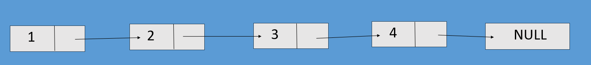
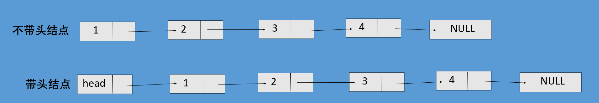
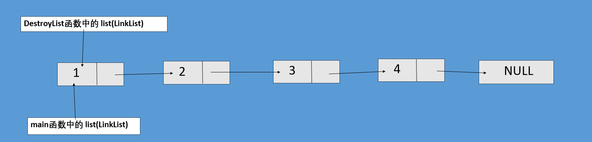
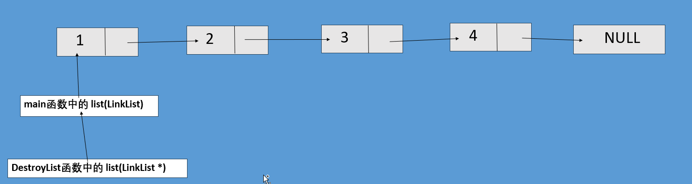
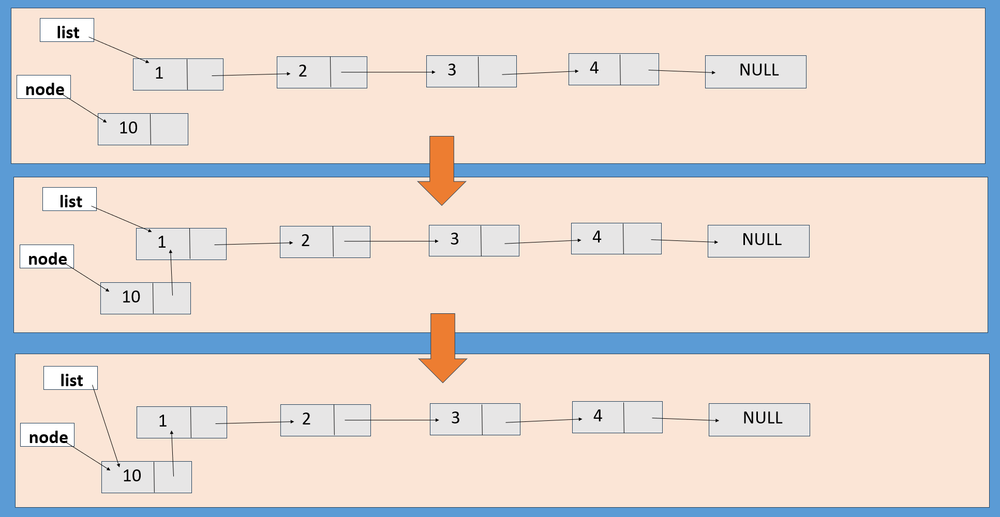
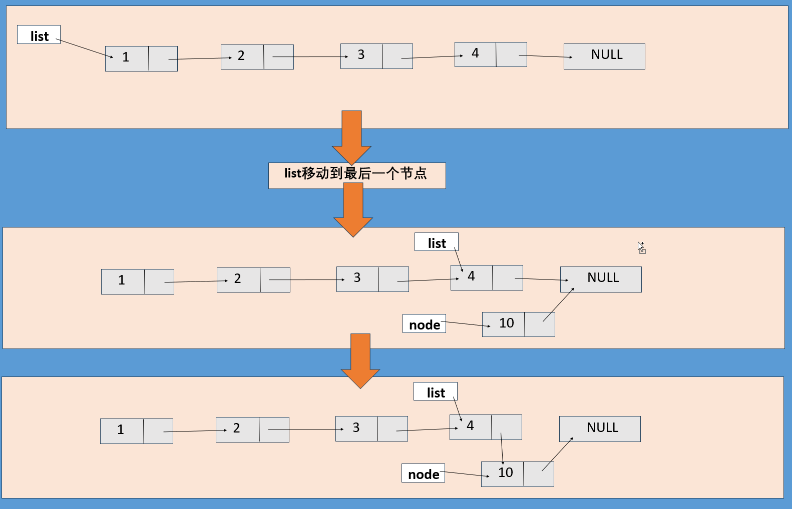
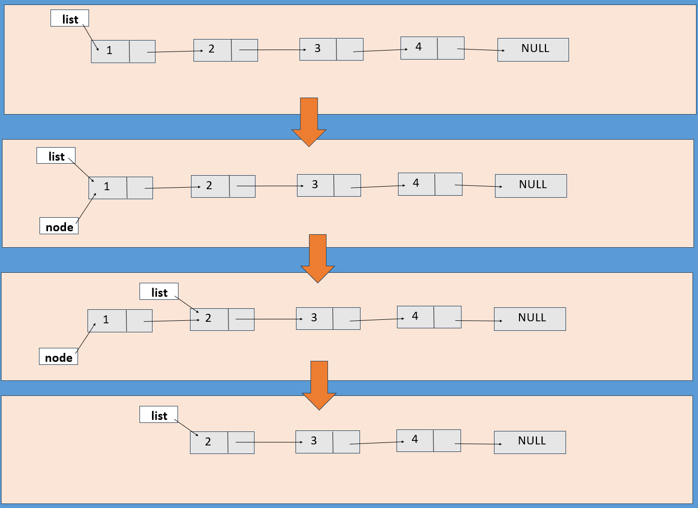
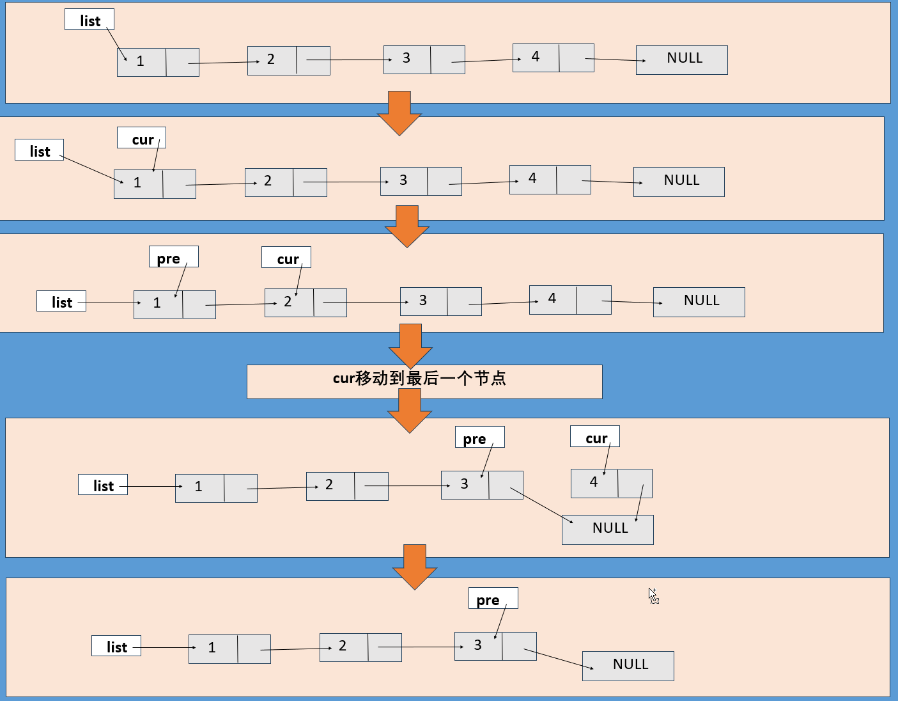
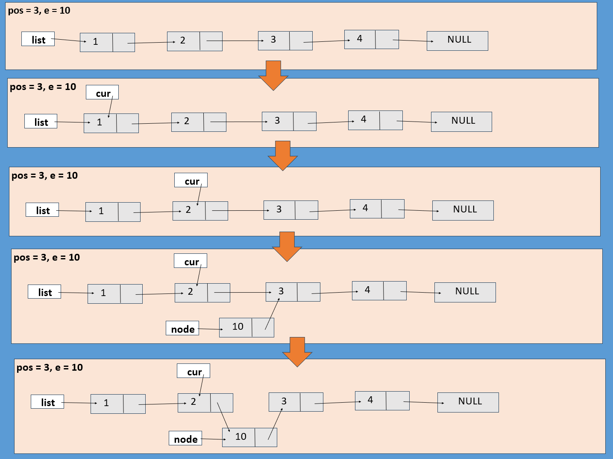
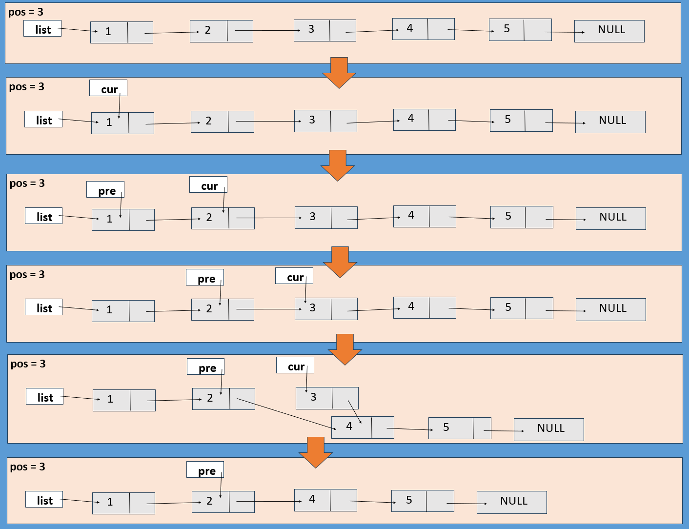

# C语言实现单链表（不带头结点）

## 一、什么是单链表

1. 单链表的节点分为两个部分，一部分存储数据、另一部分存储下一节点的指针，最后一个节点没有下一节点，则指向 `NULL`

   

2. 单链表分为带头结点和不带头结点

   - 带头结点：对与一些基本操作，可以很方便的实现

   - 不带头结点：对于一些基本操作，实现起来会比带头结点的复杂

   

3. 单链表的优缺点：

   - 优点：
     1. 不需要存储在连续的内存中
     2. 单链表的修改很方便
   - 缺点：
     1. 不能直接访问对应节点，需要依次往后访问
     2. 每个节点都需要浪费空间存放下一节点的指针

## 二、基本操作

### 0. 定义

- `data` 用于存储数据，`next` 用于存储下一节点的指针
- 将结构体重命名为 `LinkNode` 和 `*LinkList`
  - `LinkNode` 用于表示节点
  - `*LinkList` 用于表示链表

```c
// 定义
typedef struct Node
{
    int data;
    struct Node* next;
} LinkNode, *LinkList;
```


### 1. 初始化链表

- 不带头结点的单链表初始化只需要将链表设置为空即可

```c
LinkList InitList()
{
    LinkList list = NULL;
    return list;
}
```


### 2. 销毁链表

- 因为需要将 `list` 的修改后值带回，所以要用 `LinkList*` 类型，而`LinkList` 类型无法将修改后的值带回，就像下面两张图一样：

  - 使用 `LinkList` 类型 `list` 虽然指向的地址相同，名字也相同，但却是两个不同的变量（就好比有两个人他们都叫小明，他们都是同一个学校的，但是他们的身份证号是不同的。这里的小明就是变量名，同一个学校就是 `list` 都指向同一个位置，身份证号就是两个 `list` 在内存中的位置）
  - 使用 `LinkList*` 类型，可以通过解引用（`*list`）修改 `list` 的值

  

  

- `next` 的类型为什么是 `LinkNode*` 而不是 `LinkList` ?

  - `LinkNode*` 与 `LinkList` 所表达的含义是一样的，并没有任何本质区别，但是 `LinkNode*` 更多的是要表达指向节点的指针，`LinkList` 则是表示指向链表的指针
  - 虽然说两者没有本质的区别，但还是建议根据含义的不同，使用不同的类型，这可以提高代码的可读性

```c
status DestroyList(LinkList* list)
{
    while((*list) != NULL)	// 当 *list 等于 NULL 时，表示链表为空
    {
        LinkNode* next = (*list)->next;
        free(*list);		// 释放当前节点
        (*list) = next;		// *list 指向下一节点
    }

    (*list) = NULL;			// 将 *list 指向 NULL，防止野指针
    return SUCCESS;
}
```


### 3. 头插法插入

- `malloc` 函数当空间不足时，会返回 `NULL`, `node = NULL` 时，就不应该继续往后执行

- 修改`next` 指针时，要注意修改指针的顺序，先将 `node` 指向 `list` ，再修改 `list`

  

```c
status HeadInsertList(LinkList* list, int e)
{
    LinkNode* node = (LinkNode*)malloc(sizeof(LinkNode));
    if(node == NULL)
    {
        return FAILURE;
    }
    node->next = (*list);
    node->data = e;
    (*list) = node;
    return SUCCESS;
}
```


### 4. 尾插法插入

- 定位到单链表的末尾，再将末尾的 `next` 指向新的节点



```c
status TailInsertList(LinkList list, int e)
{
    LinkNode* node = (LinkNode*)malloc(sizeof(LinkNode));
    if(node == NULL)
        return FAILURE;

    while(list->next != NULL)
        list = list->next;

    node->data = e;
    node->next = NULL;
    list->next = node;
    
    return SUCCESS;
}
```


### 5. 头删法删除

- 删除第一个元素时，会修改 `list` 所以要传入 `LinkList *`  类型的参数
- 先将 `list` 指向第二个节点，再将第一个节点释放



```c
status HeadDeleteList(LinkList* list)
{
    LinkNode* node = (*list);
    (*list) = (*list)->next;
    free(node);

    return SUCCESS;
}
```


### 6. 尾删法删除

- `cur` 用于遍历整个单链表，查找最后一个节点，`pre` 用于存放 `cur` 指向节点的前一个节点

- 当 `cur` 指向最后一个节点时，释放 `cur`，并将 `pre` 指向节点的 `next` 设置为 `NULL`

- 当单链表中只有一个节点时，使用尾删法会修改 `list` 的值，所以参数应该为 `LinkList*` 类型

  

```c
status TailDeleteList(LinkList* list)
{
    LinkNode* cur = (*list);
    LinkNode* pre = NULL;
    while(cur->next != NULL)
    {
        pre = cur;
        cur = cur->next;
    }

    if((*list) == cur)
        (*list) = NULL;
    else
        pre->next = NULL;

    free(cur);

    return SUCCESS;
}
```


### 7. 按位插入 

- 当要在第一位插入时，需要进行特殊处理，可以直接使用头插法进行插入

- 需要再其他位值插入时，只需要找到要插入位置的前一位，将新节点的 `next` 指向当前位置的下一节点，再将当前节点的 `next` 指向新节点

  

```c
status InsertList(LinkList* list, int pos, int e)
{
    if(pos == 1)
    {
        return HeadInsertList(list, e);
    }
    
    int count = 1;
    LinkNode* cur = (*list);
    LinkNode* node = (LinkNode*)malloc(sizeof(LinkNode));
    if(node == NULL)
        return FAILURE;
    while(count < pos - 1 && cur != NULL)
    {
        cur = cur->next;
        count++;
    }

    if(cur == NULL)
    {
        return FAILURE;
    }

    node->data = e;
    node->next = cur->next;
    cur->next = node;
    return SUCCESS;
}
```


### 8. 按位删除

- 先将 `cur` 移动到要删除的节点，将`pre->next` 指向 `cur->next`，最后释放掉 `cur` 指向的节点

  

```c
status DeleteList(LinkList* list, int pos)
{
    if(pos == 1)
        return HeadDeleteList(list);
    
    int count = 1;
    LinkNode* cur = (*list);
    LinkNode* pre = NULL;
    while(count < pos && cur != NULL)
    {
        pre = cur;
        cur = cur->next;
        count++;
    }

    if(cur == NULL)
        return FAILURE;
    
    pre->next = cur->next;
    free(cur);
    
    return SUCCESS;
}
```


### 9. 打印链表

- 循环打印每一个节点，当 `list` 等于 `NULL` 时，表示以及遍历了整个链表

```c
status PrintList(LinkList list)
{
    while(list != NULL)
    {
        printf("%d -> ", list->data);
        list = list->next;
    }
    printf("NULL\n");
    return SUCCESS;
}
```


### 10. 按位查找

```c
LinkNode* GetNode(LinkList list, int pos)
{
    int count = 1;
    while(count < pos && list != NULL)
    {
        list = list->next;
        count++;
    }

    return list;
}
```


### 11. 按值查找

```c
LinkNode* LocateElem(LinkList list, int e)
{
    while (list != NULL)
    {
        if(list->data == e)
            return list;
        list = list->next;
    }

    return list;
}
```


### 12. 求表长

```c
int Length(LinkList list)
{
    if(list == NULL)
        return 0;

    int count = 1;
    while (list)
    {
        list = list->next;
        count++;
    }
    
    return count;
}
```


## 三、完整代码

- LinkedList.h

  ```c
  #pragma once
  
  #include<stdio.h>
  #include<stdlib.h>
  
  #define FAILURE 0
  #define SUCCESS 1
  typedef int status;
  
  // 定义
  typedef struct Node
  {
      int data;
      struct Node* next;
  } LinkNode, *LinkList;
  
  // 1. 初始化链表
  LinkList InitList();
  
  // 2. 销毁链表
  status DestroyList(LinkList* list);
  
  // 3. 头插法插入
  status HeadInsertList(LinkList* list, int e);
  
  // 4. 尾插法插入
  status TailInsertList(LinkList list, int e);
  
  // 5. 头删法删除
  status HeadDeleteList(LinkList* list);
  
  // 6. 尾删法删除
  status TailDeleteList(LinkList* list);
  
  // 7. 按位插入 
  status InsertList(LinkList* list, int pos, int e);
  
  // 8. 按位删除
  status DeleteList(LinkList* list, int pos);
  
  // 9. 打印链表
  status PrintList(LinkList list);
  
  // 10. 按位查找
  LinkNode* GetNode(LinkList list, int pos);
  
  // 11. 按值查找
  LinkNode* LocateElem(LinkList list, int e);
  
  // 12. 求表长
  int Length(LinkList list);
  ```

  

- LinkedList.c

  ```c
  #include "./head/LinkedList.h"
  
  // 1. 初始化链表
  LinkList InitList()
  {
      LinkList list = NULL;
      return list;
  }
  
  // 2. 销毁链表
  status DestroyList(LinkList* list)
  {
      while((*list) != NULL)
      {
          LinkNode* next = (*list)->next;
          free(*list);
          (*list) = next;
      }
  
      (*list) = NULL;
      return SUCCESS;
  }
  
  // 3. 头插法插入
  status HeadInsertList(LinkList* list, int e)
  {
      LinkNode* node = (LinkNode*)malloc(sizeof(LinkNode));
      if(node == NULL)
      {
          return FAILURE;
      }
      node->next = (*list);
      node->data = e;
      (*list) = node;
      return SUCCESS;
  }
  
  // 4. 尾插法插入
  status TailInsertList(LinkList list, int e)
  {
      LinkNode* node = (LinkNode*)malloc(sizeof(LinkNode));
      if(node == NULL)
          return FAILURE;
  
      while(list->next != NULL)
          list = list->next;
  
      node->data = e;
      node->next = NULL;
      list->next = node;
      
      return SUCCESS;
  }
  
  
  // 5. 头删法删除
  status HeadDeleteList(LinkList* list)
  {
      LinkNode* node = (*list);
      (*list) = (*list)->next;
      free(node);
  
      return SUCCESS;
  }
  
  // 6. 尾删法删除
  status TailDeleteList(LinkList* list)
  {
      LinkNode* cur = (*list);
      LinkNode* pre = NULL;
      while(cur->next != NULL)
      {
          pre = cur;
          cur = cur->next;
      }
  
      if((*list) == cur)
          (*list) = NULL;
      else
          pre->next = NULL;
  
      free(cur);
  
      return SUCCESS;
  }
  
  // 7. 按位插入 
  status InsertList(LinkList* list, int pos, int e)
  {
      if(pos == 1)
      {
          return HeadInsertList(list, e);
      }
      
      int count = 1;
      LinkNode* cur = (*list);
      LinkNode* node = (LinkNode*)malloc(sizeof(LinkNode));
      if(node == NULL)
          return FAILURE;
      while(count < pos - 1 && cur != NULL)
      {
          cur = cur->next;
          count++;
      }
  
      if(cur == NULL)
      {
          return FAILURE;
      }
  
      node->data = e;
      node->next = cur->next;
      cur->next = node;
      return SUCCESS;
  }
  
  // 8. 按位删除
  status DeleteList(LinkList* list, int pos)
  {
      if(pos == 1)
          return HeadDeleteList(list);
      
      int count = 1;
      LinkNode* cur = (*list);
      LinkNode* pre = NULL;
      while(count < pos && cur != NULL)
      {
          pre = cur;
          cur = cur->next;
          count++;
      }
  
      if(cur == NULL)
          return FAILURE;
      
      pre->next = cur->next;
      free(cur);
  
      return SUCCESS;
  }
  
  // 9. 打印链表
  status PrintList(LinkList list)
  {
      while(list != NULL)
      {
          printf("%d -> ", list->data);
          list = list->next;
      }
      printf("NULL\n");
      return SUCCESS;
  }
  
  // 10. 按位查找
  LinkNode* GetNode(LinkList list, int pos)
  {
      int count = 1;
      while(count < pos && list != NULL)
      {
          list = list->next;
          count++;
      }
  
      return list;
  }
  
  
  // 11. 按值查找
  LinkNode* LocateElem(LinkList list, int e)
  {
      while (list != NULL)
      {
          if(list->data == e)
              return list;
          list = list->next;
      }
  
      return list;
  }
  
  // 求表长
  int Length(LinkList list)
  {
      if(list == NULL)
          return 0;
  
      int count = 1;
      while (list)
      {
          list = list->next;
          count++;
      }
      
      return count;
  }
  ```
  
  
