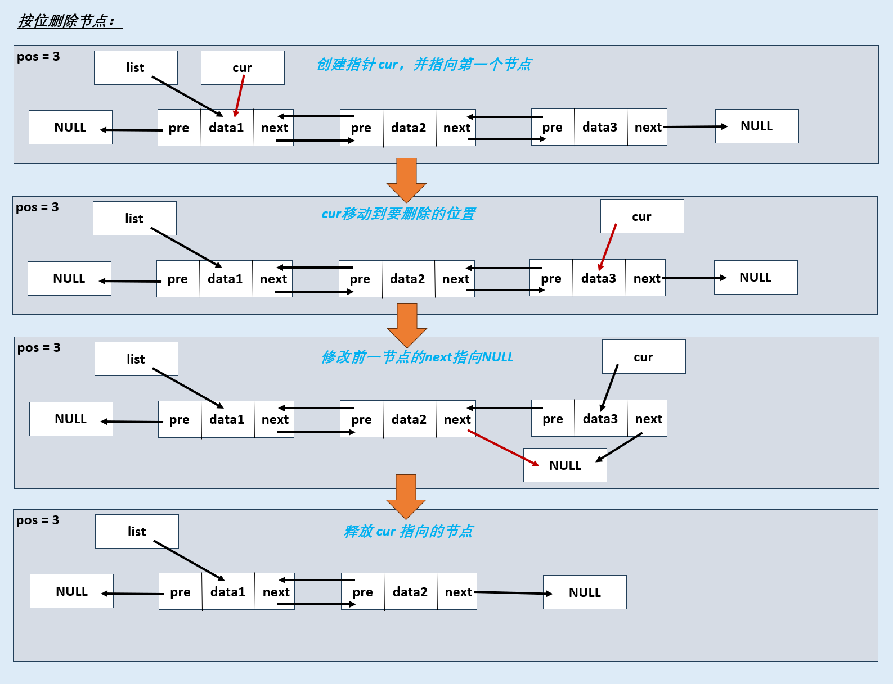

# 【数据结构】C语言实现双链表

## 一、双链表的定义

- 双链表是在单链表的基础上增加了指向上一节点的指针，解决了单链表无法知道前一节点的问题。

- 单链表分为带头结点和不带头结点：

  

## 二、基本操作

### 0.定义

- `data` 用于存储数据，`pre` 存储前面一个节点的指针，`next` 存储后面一节点的指针
- `DNode*` 与 `DList` 作用是一样的，但是：
  - `DNode*` 更加强调这是指向节点的指针
  - `DList` 则更强调这是指向链表的指针


```c
typedef struct DNode
{
    int data;
    struct DNode *pre, *next;
}DNode, *DList;
```


### 1.初始化


```c
DList InitList()
{
    DList list = NULL;
    return list;
}
```

说明：

- 本文使用不带头结点的双链表，一开始并没有节点，所以不需要创建节点，只需要将链表指针指向 `NULL`


### 2.销毁链表


```c
status DestroyList(DList* list)
{
    DNode* node = NULL;
    while((*list) != NULL)
    {
        node = (*list)->next;
        free(*list);
        (*list) = node;
    }

    return EXIT_SUCCESS;
}
```

说明：

- 销毁全部链表后将 `list` 设置为 `NULL`，是为了避免销毁链表后使用 `list`

- `EXIT_SUCCESS` 与后面出现的 `EXIT_FAILURE` 是在头文件 `stdlib.h` 中定义的常量

  - `#define   EXIT_FAILURE   1`

  - `#define   EXIT_SUCCESS   0`

  - 需要注意两个常量的值，不要用错了，建议使用常量名判断返回值，而不是使用 0 和 1 进行判断


### 3.头插法插入


```c
status HeadInsertList(DList* list, int e)
{
    DNode* node = (DNode*)malloc(sizeof(DNode));
    if(node == NULL)
    {
        return EXIT_FAILURE;
    }
    
    if((*list) != NULL)
        (*list)->pre = node;

    node->data = e;
    node->next = (*list);
    node->pre = NULL;
    (*list) = node;

    return EXIT_SUCCESS;
}
```

说明：

- 当链表为空时，使用头插法插入 `(*list)->pre` 会出错，所以修改 `(*list)->pre` 时需要判断链表是否为空


### 4.尾插法插入


```c
status TailInsertList(DList* list, int e)
{
    DNode* cur = (*list);
    
    //判断的顺序不能交换，不然会出错
    while((*list) != NULL && cur->next != NULL)	
    {
        cur = cur->next;
    }

    DNode* node = (DNode*)malloc(sizeof(DNode));
    if(node == NULL)
        return EXIT_FAILURE;

    node->next = NULL;
    node->data = e;
    node->pre = cur;

    if((*list) == NULL)
        (*list) = node;
    else
        cur->next = node;

    return EXIT_SUCCESS;
}
```

说明：

- 当 `list` 中没有节点时， `cur->next` 会出错，所以在执行该语句前，应该先判断链表中是否有节点


### 5.按位插入


```c
status InsertList(DList* list, int pos, int e)
{
    if(pos == 1)
        return HeadInsertList(list, e);

    int count = 1;
    DNode* cur = (*list);
    while (cur->next != NULL && count < pos - 1)
    {
        cur = cur->next;
        count++;
    }

    if(count < pos - 1)
        return EXIT_FAILURE;
    
    DNode* node = (DNode*)malloc(sizeof(DNode));
    if(node == NULL)
        return EXIT_FAILURE;

    node->data = e;
    node->pre = cur;
    node->next = cur->next;

    if(cur->next != NULL)       // 当 cur->next 不为NULL时，才需要修改后面节点的 pre 指针
        cur->next->pre = node;
    
    cur->next = node;
    
    return EXIT_SUCCESS;
}
```

说明：

- 按位插入时，如果要插入的位置是第一位和最后一位时需要特殊操作
  1. 要在第一位插入时：当插入第一位时会修改 `list` 的指向，可以调用头插法函数 `HeadInsertList()` 完成操作
  2. 要在最后一位插入时：在最后一位插入时，后面已经没有节点了，这时`cur->next->pre` 是会出错的，所以在执行该语句前要先判断是否是在最后一位插入(判断 `cur->next` 是否等于 `NULL`)


### 6.头删法删除


```c
status HeadDeleteList(DList* list)
{
    if((*list) == NULL)
        return EXIT_FAILURE;

    // 判断链表是否只有一个节点，第一个节点的下一个节点为NULL，表示链表中只有一个节点
    if((*list)->next == NULL)
    {
        free(*list);
        *list = NULL;
        return EXIT_SUCCESS;
    }
    
    (*list) = (*list)->next;
    free((*list)->pre);
    (*list)->pre = NULL;

    return EXIT_SUCCESS;
}
```

说明：

- 当链表中只有一个节点时，`(*list) = (*list)->next;` 会导致链表丢失，即无法释放链表中的节点，所以需要判断链表是否只要一个节点(`(*list)->next` 是否等于 `NULL`)，如果是则释放 `*list` ，再将 `*list` 指向 `NULL`，否则`*list`移动到下一位，释放`(*list)->pre`  ，再将 `(*list)->pre` 指向 `NULL`


### 7.尾删法删除


  ```c
  status TailDeleteList(DList* list)
  {
      if((*list) == NULL)
          return EXIT_FAILURE;
      DNode* cur = (*list);
      while (cur->next != NULL)
          cur = cur->next;
  
      // 判断是否只有一个节点，当最后一个节点的前一节点为NULL，表示当前链表只有一个节点
      if(cur->pre != NULL)
          cur->pre->next = NULL;
  
      free(cur);
      return EXIT_SUCCESS;
  }
  ```

说明：

- 当只有一个节点时，最后一个节点没有前节点，不需要将前面节点的 `next` 设置为 `NULL`


### 8.按位删除



  ```c
  status DeleteList(DList* list, int pos)
  {
      if((*list) == NULL)
          return EXIT_FAILURE;
  
      if(pos == 1)
          return HeadDeleteList(list);
  
      int count = 1;
      DNode* cur = (*list);
      while (cur != NULL && count < pos)
      {
          cur = cur->next;
          count++;
      }
  
      
      if(cur == NULL)
          return EXIT_FAILURE;
  
      cur->pre->next = cur->next;
      if(cur->next != NULL)
          cur->next->pre = cur->pre;
      
      free(cur);
      return EXIT_SUCCESS;
  }
  ```

说明：

- 当修改删除节点的后一节点时需要先判断节点是否是 `NULL`


### 9.打印链表


  ```c
  status PrintList(DList list)
  {
      while(list != NULL)
      {
          printf("%d -> ", list->data);
          list = list->next;
      }
      printf("NULL\n");
  }
  ```


### 10.按位查找


  ```c
  DNode* GetNode(DList list, int pos)
  {
      int count = 1;
      DNode* node = list;
      while (node != NULL && count < pos)
      {
          node = node->next;
          count++;
      }
      return node;
  }
  ```


### 18.按值查找


  ```c
  DNode* LocateElem(DList list, int e)
  {
      DNode* node = list;
      while (node != NULL)
      {
          if(node->data == e)
              return node;
          
          node = node->next;
      }
      
      return node;
  }
  ```


### 12.求表长


  ```c
  int* Length(DList list)
  {
      if(list == NULL)
          return 0;
  
      int len = 1;
      DNode* node = list;
      while (node->next != NULL)
      {
          node = node->next;
          len++;
      }
  
      return len;
  }
  ```

## 三、完整代码

- DLinkList.h

  ```c
  #include<stdio.h>
  #include<stdlib.h>
  
  typedef int status;
  
  // 双链表的定义
  typedef struct DNode
  {
      int data;
      struct DNode *pre, *next;
  }DNode, *DList;
  
  // 1. 初始化
  DList InitList();
  
  // 2. 销毁链表
  status DestroyList(DList* list);
  
  // 3. 头插法插入
  status HeadInsertList(DList* list, int e);
  
  // 4. 尾插法插入
  status TailInsertList(DList* list, int e);
  
  // 5. 按位插入
  status InsertList(DList* list, int pos, int e);
  
  // 6. 头删法删除
  status HeadDeleteList(DList* list);
  
  // 7. 尾删法删除
  status TailDeleteList(DList* list);
  
  // 8. 按位删除
  status DeleteList(DList* list, int pos);
  
  // 9. 打印链表
  status PrintList(DList list);
  
  // 10. 按位查找
  DNode* GetNode(DList list, int pos);
  
  // 11. 按值查找
  DNode* LocateElem(DList list, int e);
  
  // 12. 求表长
  int Length(DList list);
  ```

  

- DLinkList.c
  ```c
  #include "./head/DLinkList.h"
  
  
  // 1. 初始化
  DList InitList()
  {
      DList list = NULL;
      return list;
  }
  
  // 2. 销毁链表
  status DestroyList(DList* list)
  {
      DNode* node = NULL;
      while((*list) != NULL)
      {
          node = (*list)->next;
          free(*list);
          (*list) = node;
      }
  
      return EXIT_SUCCESS;
  }
  
  // 3. 头插法插入
  status HeadInsertList(DList* list, int e)
  {
      DNode* node = (DNode*)malloc(sizeof(DNode));
      if(node == NULL)
      {
          return EXIT_FAILURE;
      }
      
      if((*list) != NULL)
          (*list)->pre = node;
  
      node->data = e;
      node->next = (*list);
      node->pre = NULL;
      (*list) = node;
  
      return EXIT_SUCCESS;
  }
  
  // 4. 尾插法插入
  status TailInsertList(DList* list, int e)
  {
      DNode* cur = (*list);
      
      //判断的顺序不能交换，不然会出错
      while((*list) != NULL && cur->next != NULL)	
      {
          cur = cur->next;
      }
  
      DNode* node = (DNode*)malloc(sizeof(DNode));
      if(node == NULL)
          return EXIT_FAILURE;
  
      node->next = NULL;
      node->data = e;
      node->pre = cur;
  
      if((*list) == NULL)
          (*list) = node;
      else
          cur->next = node;
  
      return EXIT_SUCCESS;
  }
  
  // 5. 按位插入
  status InsertList(DList* list, int pos, int e)
  {
      if(pos == 1)
          return HeadInsertList(list, e);
  
      int count = 1;
      DNode* cur = (*list);
      while (cur->next != NULL && count < pos - 1)
      {
          cur = cur->next;
          count++;
      }
  
      if(count < pos - 1)
          return EXIT_FAILURE;
      
      DNode* node = (DNode*)malloc(sizeof(DNode));
      if(node == NULL)
          return EXIT_FAILURE;
  
      node->data = e;
      node->pre = cur;
      node->next = cur->next;
  
      if(cur->next != NULL)       // 当 cur->next 不为NULL时，才需要修改后面节点的 pre 指针
          cur->next->pre = node;
      
      cur->next = node;
      
      return EXIT_SUCCESS;
  }
  
  // 6. 头删法删除
  status HeadDeleteList(DList* list)
  {
      if((*list) == NULL)
          return EXIT_FAILURE;
  
      // 判断链表是否只有一个节点，第一个节点的下一个节点为NULL，表示链表中只有一个节点
      if((*list)->next == NULL)
      {
          free(*list);
          *list = NULL;
          return EXIT_SUCCESS;
      }
      
      (*list) = (*list)->next;
      free((*list)->pre);
      (*list)->pre = NULL;
  
      return EXIT_SUCCESS;
  }
  
  // 7. 尾删法删除
  status TailDeleteList(DList* list)
  {
      if((*list) == NULL)
          return EXIT_FAILURE;
      DNode* cur = (*list);
      while (cur->next != NULL)
          cur = cur->next;
  
      // 判断是否只有一个节点，当最后一个节点的前一节点为NULL，表示当前链表只有一个节点
      if(cur->pre != NULL)
          cur->pre->next = NULL;
  
      free(cur);
      return EXIT_SUCCESS;
  }
  
  
  // 8. 按位删除
  status DeleteList(DList* list, int pos)
  {
      if((*list) == NULL)
          return EXIT_FAILURE;
  
      if(pos == 1)
          return HeadDeleteList(list);
  
      int count = 1;
      DNode* cur = (*list);
      while (cur != NULL && count < pos)
      {
          cur = cur->next;
          count++;
      }
  
      
      if(cur == NULL)
          return EXIT_FAILURE;
  
      cur->pre->next = cur->next;
      if(cur->next != NULL)
          cur->next->pre = cur->pre;
      
      free(cur);
      return EXIT_SUCCESS;
  }
  
  
  // 9. 打印链表
  status PrintList(DList list)
  {
      while(list != NULL)
      {
          printf("%d -> ", list->data);
          list = list->next;
      }
      printf("NULL\n");
  }
  
  // 10. 按位查找
  DNode* GetNode(DList list, int pos)
  {
      int count = 1;
      DNode* node = list;
      while (node != NULL && count < pos)
      {
          node = node->next;
          count++;
      }
      return node;
  }
  
  // 11. 按值查找
  DNode* LocateElem(DList list, int e)
  {
      DNode* node = list;
      while (node != NULL)
      {
          if(node->data == e)
              return node;
          
          node = node->next;
      }
      
      return node;
  }
  
  // 12. 求表长
  int* Length(DList list)
  {
      if(list == NULL)
          return 0;
  
      int len = 1;
      DNode* node = list;
      while (node->next != NULL)
      {
          node = node->next;
          len++;
      }
  
      return len;
  }
  ```