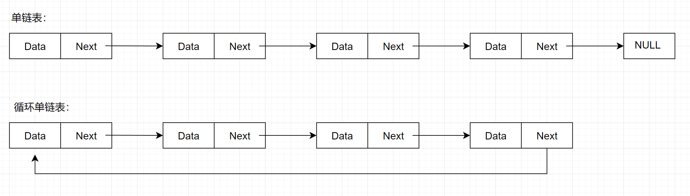
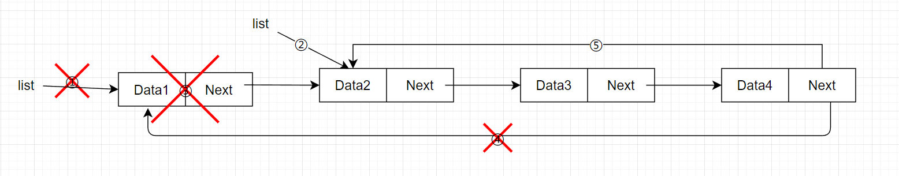

# 【数据结构】C语言实现循环单链表

[toc]


## 一、定义

- 与单链表相似，只不过单链表最后一个节点的 `next` 指向 `NULL`，循环单链表最后一个节点指向链表的第一个节点

  

- 循环单链表也是分为带头结点和不带头结点，部分操作对于不带头结点的循环单链表实现会复杂一些

- 循环单链表最大的优点就是只要知道其中一个节点就可以访问链表中的全部节点


## 二、基本操作

### 1.初始化链表

本文主要讨论**不带头结点**的循环单链表，初始化链表时不存在任何节点，所以将链表的指针指向 `NULL`

```c
LinkList InitList()
{
    LinkList list = NULL;
    return list;
}
```


### 2.头插法

有两种方法可以实现头插法

1. 方法一**（不太建议）**：

   

   - 这个方法需要找到最后一个节点，然后修改它的 `next` 指向新的头节点，很麻烦，要遍历整个链表，就不多介绍了

2. 方法二**（建议）**：

   

   1. 创建新的节点，新节点的数据域存放，链表中第一个节点的数据
   2. 将新节点插入到链表的第二位
   3. 将第一个节点的数据修改为要插入的数据

```c
status HeadInsertList(LinkList* list, int data)
{
    LinkNode* node = (LinkNode*)malloc(sizeof(LinkNode));
    // 当 node 没有成功分配内存时，直接返回
    if(node == NULL)
        return EXIT_FAILURE;
    

    if((*list) != NULL)
    {
        node->data = (*list)->data;     // 将新节点的数据域，存放第一个节点的数据
        node->next = (*list)->next;     // 当链表中存在节点，则将 node->next 设置为第一个节点
        (*list)->next = node;
        (*list)->data = data;
    }
    else
    {
        node->data = data;
        node->next = node;     // 链表中没有节点，将 node->next 指向自己
        (*list) = node;        // 修改头指针指向 node
    }

    return EXIT_SUCCESS;
}
```


### 3.尾插法

实现从尾部插入新节点，要先找到链表的最后一个节点：


```c
status TailInsertList(LinkList* list, int e)
{
    LinkNode* cur = (*list);
    // 判断 cur != NULL,是为了避免链表中没有节点而发生错误，当节点的 next 指向第一个节点，表示该节点为最后一个节点
    while (cur != NULL && cur->next != (*list))       
        cur = cur->next;

    LinkNode* node = (LinkNode*)malloc(sizeof(LinkNode));
    if (node == NULL)
        return EXIT_FAILURE;

    node->data = e;
    if (cur == NULL)    // 链表中没有节点
    {
        node->next = node;
        (*list) = node;
    }
    else                // 链表中有节点
    {
        node->next = (*list);
        cur->next = node;
    }
    
    return EXIT_SUCCESS;
}
```


### 4.按位插入

当链表要在第一位插入节点时，需要进行特殊处理，可以使用[头插法](#2.头插法)解决，在其他位置插入时，先修改新建节点的 `next` 指针指向下一个节点，再修改前面节点的 `next` 指向新节点


```c
status InsertList(LinkList* list, int pos, int data)
{
    // 初步判断值是否有效，大于等于 1 不代表pos位置能够插入，但小于 1 一定不能插入
    if(pos < 1)
        return EXIT_FAILURE;

    // 当要在第一位插入时，可以使用头差法插入
    if (pos == 1)
        return HeadInsertList(list, data);

    LinkNode* curNode = *list;
    int count = 1;      // 表示当前的位置

    while (curNode->next != *list && count < pos - 1)
    {
        // 
        curNode = curNode->next;
        count++;
    }

    // 当 count < pos - 1时，代表已经到最后一个节点了，但是还是没有到达pos - 1的位置
    if(count < pos - 1)
        return EXIT_FAILURE;

    
    LinkNode* node = (LinkNode*)malloc(sizeof(LinkNode));
    if(node == NULL)
        return EXIT_FAILURE;
    

    node->data = data;
    node->next = curNode->next;
    curNode->next = node;

    return EXIT_SUCCESS;
}
```


### 5.头删法

头删法也有两种方式删除：

- 第一种方法：将第一个节点删除，修改最后一个节点的 `next` 指向新的头结点，这会很麻烦，需要遍历整个链表。

  

- 第二种方法的思路是：将第二个节点的数据放入到第一个节点中，然后删除掉第二个节点，这样可以不需要修改最后一个节点的 `next` 指针

  

```c
status HeadDeleteList(LinkList* list)
{
    // 判断 next 是否指向本身，如果是表示只有一个节点
    if((*list)->next == *list)
    {
        // 只有一个节点时，释放后需要将指针指向 NULL
        free(*list);
        *list = NULL;
    }
    else
    {
        LinkNode* curNode = (*list)->next;
        (*list)->next = curNode->next;
        (*list)->data = curNode->data;
        free(curNode);
    }

    return EXIT_SUCCESS;
}
```


### 6.尾删法

将倒数第二个节点的 `next` 指向第一个节点，然后将最后一个节点删除


```c
status TailDeleteList(LinkList* list)
{
    LinkNode* cur = *list;
    LinkNode* pre = NULL;

    // 遍历链表，cur 表示当前的节点， pre 表示前一个节点
    while(cur->next != *list)
    {
        pre = cur;
        cur = cur->next;
    }
    free(cur);

    // 当 pre == NULL，则说明链表只有一个节点
    if(pre == NULL)
        *list = NULL;       // 只有一个节点，删除后没有节点，所以 *list 指向 NULL
    else
        pre->next = *list;  // 有多个节点, 将删除后的最后一个节点，指向开头

    return EXIT_SUCCESS;
}
```


### 7. 按位删除

当要删除的是第一位时，需要修改 `list` 的指向，可以使用[头删法](#_5.头删法)删除，在其他位置时，只需将删除节点的前一节点的 `next` 修改为 删除节点的 `next` ，最后将删除节点


```c
status DeleteList(LinkList* list, int pos)
{
    // 判断 pos 是否小于1，插入位置不能小于 1
    if (pos < 1)
        return EXIT_FAILURE;
    // 当 pos 等于 1 时，使用头插法
    if (pos == 1)
        return HeadDeleteList(list);
    
    int curPos = 1;                 // 当前节点的位置
    LinkNode* curNode = *list;     // 用于查找要删除的节点
    LinkNode* preNode = NULL;      // 指向 curNode 的前一个节点，一开始没有前一节点，所以初始化为NULL
    while (curNode->next != *list && curPos < pos)
    {
        // 移动 curNode，直到 curNode 指向第 pos 位节点
        preNode = curNode;
        curNode = curNode->next;
        curPos++;
    }

    // 当 curPos 小于 pos-1 时，curNode 已经指向最后一个节点，故要插入的位置超出当前链表长度
    if(curPos < pos - 1)
        return EXIT_FAILURE;

    preNode->next = curNode->next;
    free(curNode);
}
```


### 8.打印链表

循环遍历链表的所有节点，并将节点的数据打印出来，使用`do ... while` 是为了更好的判断最后一个节点，当第一次判断 `cur != list` 时，cur已经不是指向开头了，而是指向第二个节点的位置，使用 `cur != list` 判断是否完全遍历整个链表是没有问题的，而要使用其他循环打印会变得麻烦

```c
status PrintList(LinkList  list)
{
    // list == NULL 链表中没有节点；
    LinkNode* cur = list;

    do
    {
        printf("%d -> ", cur->data);    // 打印当前节点的数据
        cur = cur->next;    // cur 指向下一个节点
    }while (cur != list);   // cur == list 时表示已经遍历了整个链表，如果使用 cur->next != list 进行判断最后一个节点会无法打印     

    printf("NULL\n");
    
    return EXIT_SUCCESS;
}

```


### 9.销毁链表

遍历所有的节点，当有节点的 `next` 指向当前链表的第一个节点则结束，删除遍历的节点，最后将链表指针指向 `NULL`（可以理解为循环调用头删法，直到链表中没有节点）

``` c
status DestroyList(LinkList* list)
{
    if((*list) == NULL)
        return EXIT_FAILURE;
    
    LinkNode* curNode = *list;     // curNode指向要释放的节点
    LinkNode* nextNode = NULL;     // nextNode 指向要释放节点的下一节点

    while (curNode->next != *list)  // 当 curNode->next 指向头指针，curNode指向的是最后一个节点
    {
        nextNode = curNode->next;
        free(curNode);
        curNode = nextNode;
    }
    *list = NULL;

    return EXIT_SUCCESS;
}
```


## 三、完整代码

- LoopLinkList.h

  ```c
  #include<stdio.h>
  #include<stdlib.h>
  
  typedef int status;
  typedef struct Node
  {
      int data;
      struct Node* next;
  }LinkNode, *LinkList;
  
  // 初始化
  LinkList InitList();
  
  // 销毁链表
  status DestroyList(LinkList* list);
  
  // 头插法
  status HeadInsertList(LinkList* list, int e);
  
  // 尾插法
  status TailInsertList(LinkList* list, int e);
  
  // 头删法
  status HeadDeleteList(LinkList* list);
  
  // 尾删法
  status TailDeleteList(LinkList* list);
  
  // 打印链表
  status PrintList(LinkList list);
  
  // 按位插入节点
  status InsertList(LinkList* list, int pos, int data);
  
  // 按位删除节点
  status DeleteList(LinkList* list, int pos);
  
  // 求表长
  int Length(LinkList list);
  
  // 按位置查找节点
  LinkNode* GetElem(LinkList list, int pos);
  
  // 按值查找节点
  LinkNode* LocateElem(LinkList list, int data);
  ```

  

- LoopLinkList.c

  ```c
  #include "./head/LoopLinkList.h"
  
  // 初始化
  LinkList InitList()
  {
      LinkList list = NULL;
      return list;
  }
  
  // 销毁链表
  status DestroyList(LinkList* list)
  {
      if((*list) == NULL)
          return EXIT_FAILURE;
      
      LinkNode* curNode = *list;     // curNode指向要释放的节点
      LinkNode* nextNode = curNode->next;     // nextNode 指向要释放节点的下一节点
  
      while (curNode->next != *list)  // 当 curNode->next 指向头指针，curNode指向的是最后一个节点
      {
          nextNode = curNode->next;
          free(curNode);
          curNode = nextNode;
      }
      *list = NULL;
  
      return EXIT_SUCCESS;
  }
  
  // 头插法
  status HeadInsertList(LinkList* list, int data)
  {
      LinkNode* node = (LinkNode*)malloc(sizeof(LinkNode));
      // 当 node 没有成功分配内存时，直接返回
      if(node == NULL)
          return EXIT_FAILURE;
      
  
      if((*list) != NULL)
      {
          node->data = (*list)->data;     // 将新节点的数据域，存放第一个节点的数据
          node->next = (*list)->next;     // 当链表中存在节点，则将 node->next 设置为第一个节点
          (*list)->next = node;
          (*list)->data = data;
      }
      else
      {
          node->data = data;
          node->next = node;     // 链表中没有节点，将 node->next 指向自己
          (*list) = node;        // 修改头指针指向 node
      }
  
      return EXIT_SUCCESS;
  }
  
  // 尾插法
  status TailInsertList(LinkList* list, int e)
  {
      LinkNode* cur = (*list);
      // 判断 cur != NULL,是为了避免链表中没有节点而发生错误，当节点的 next 指向第一个节点，表示该节点为最后一个节点
      while (cur != NULL && cur->next != (*list))       
          cur = cur->next;
  
      LinkNode* node = (LinkNode*)malloc(sizeof(LinkNode));
      if (node == NULL)
          return EXIT_FAILURE;
  
      node->data = e;
      if (cur == NULL)    // 链表中没有节点
      {
          node->next = node;
          (*list) = node;
      }
      else                // 链表中有节点
      {
          node->next = (*list);
          cur->next = node;
      }
      
      return EXIT_SUCCESS;
  }
  
  // 头删法
  status HeadDeleteList(LinkList* list)
  {
      // 判断 next 是否指向本身，如果是表示只有一个节点
      if((*list)->next == *list)
      {
          // 只有一个节点时，释放后需要将指针指向 NULL
          free(*list);
          *list = NULL;
      }
      else
      {
          LinkNode* curNode = (*list)->next;
          (*list)->next = curNode->next;
          (*list)->data = curNode->data;
          free(curNode);
      }
  
      return EXIT_SUCCESS;
  }
  
  // 尾删法
  status TailDeleteList(LinkList* list)
  {
      LinkNode* cur = *list;
      LinkNode* pre = NULL;
  
      // 遍历链表，cur 表示当前的节点， pre 表示前一个节点
      while(cur->next != *list)
      {
          pre = cur;
          cur = cur->next;
      }
      free(cur);
  
      // 当 pre == NULL，则说明链表只有一个节点
      if(pre == NULL)
          *list = NULL;       // 只有一个节点，删除后没有节点，所以 *list 指向 NULL
      else
          pre->next = *list;  // 有多个节点, 将删除后的最后一个节点，指向开头
  
      return EXIT_SUCCESS;
  }
  
  // 打印链表
  status PrintList(LinkList  list)
  {
      // list == NULL 链表中没有节点；
      LinkNode* cur = list;
  
      do
      {
          printf("%d -> ", cur->data);    // 打印当前节点的数据
          cur = cur->next;    // cur 指向下一个节点
      }while (cur != list);   // cur == list 时表示已经遍历了整个链表，如果使用 cur->next != list 进行判断最后一个节点会无法打印     
  
      printf("NULL\n");
      
      return EXIT_SUCCESS;
  }
  
  // 按位插入节点
  status InsertList(LinkList* list, int pos, int data)
  {
      // 判断值是否合法，大于等于 1 不代表pos有效，但小于1一定不能插入
      if(pos < 1)
          return EXIT_FAILURE;
  
      // 当要在第一位插入时，可以使用头差法插入
      if (pos == 1)
          return HeadInsertList(list, data);
  
      LinkNode* curNode = *list;
      int count = 1;      // 表示当前的位置
  
      while (curNode->next != *list && count < pos - 1)
      {
          // 
          curNode = curNode->next;
          count++;
      }
  
      // 当 count < pos - 1时，代表已经到最后一个节点了，但是还是没有到达pos - 1的位置
      if(count < pos - 1)
          return EXIT_FAILURE;
  
      
      LinkNode* node = (LinkNode*)malloc(sizeof(LinkNode));
      if(node == NULL)
          return EXIT_FAILURE;
      
  
      node->data = data;
      node->next = curNode->next;
      curNode->next = node;
  
      return EXIT_SUCCESS;
  }
  
  // 按位删除节点
  status DeleteList(LinkList* list, int pos)
  {
      // 判断 pos 是否小于1，插入位置不能小于 1
      if (pos < 1)
          return EXIT_FAILURE;
      // 当 pos 等于 1 时，使用头插法
      if (pos == 1)
          return HeadDeleteList(list);
      
      int curPos = 1;                 // 当前节点的位置
      LinkNode* curNode = *list;     // 用于查找要删除的节点
      LinkNode* preNode = NULL;      // 指向 curNode 的前一个节点，一开始没有前一节点，所以初始化为NULL
      while (curNode->next != *list && curPos < pos)
      {
          // 移动 curNode，直到 curNode 指向第 pos 位节点
          preNode = curNode;
          curNode = curNode->next;
          curPos++;
      }
  
      // 当 curPos 小于 pos-1 时，curNode 已经指向最后一个节点，故要插入的位置超出当前链表长度
      if(curPos < pos - 1)
          return EXIT_FAILURE;
  
      preNode->next = curNode->next;
      free(curNode);
  }
  
  // 求表长
  int Length(LinkList list)
  {
      int len = 1;
      LinkNode* curNode = list;
  
      while (curNode->next != list)
      {
          len++;
          curNode = curNode->next;
      }
  
      return len;
  }
  
  // 按位置查找节点
  LinkNode* GetElem(LinkList list, int pos)
  {
      LinkNode* curNode = list;
      int curPos = 1;
      while (curNode->next == list && curPos < pos)
      {
          curNode = curNode->next;
          curPos++;
      }
      
      if (curPos == pos)
          return curNode;
      else
          return NULL;
  }
  
  
  // 按值查找节点
  LinkNode* LocateElem(LinkList list, int data)
  {
      LinkNode* curNode = list;
  
      while (curNode->next == list)
      {
          if(curNode->data == data)
              return curNode;
          curNode = curNode->next;
      }
      
      return NULL;
  }
  ```

  
