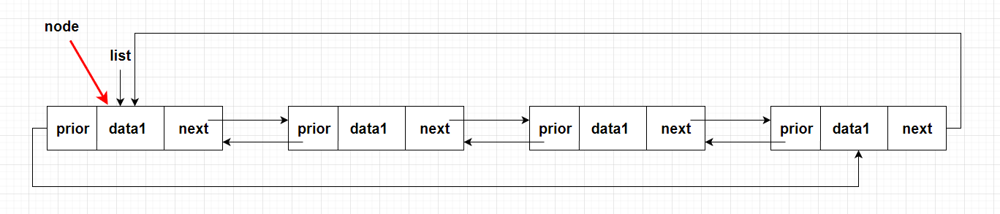

# 【数据结构】C语言实现不带头结点的循环双链表

## 一、什么是循环双链表

循环双链表与单链表的区别就在于第一个节点的 `prior` 指针和最后一个节点 `next` 指针的指向；双链表的这两个指针都指向 `NULL` ，而循环双链表第一个节点的 `prior` 指向最后一个节点，最后一个节点的 `next` 指针指向第一个节点


## 二、操作实现

### 0. 定义

- `staus` 作为返回值的类型，成功返回 `EXIT_SUCCESS`，失败返回 `EXIT_FAILURE`（返回值在头文件 `stdlib.h` 中有定义）
- 结构体中位链表节点的定义，`data` 存放数据，`prior` 指向前一个节点的地址，`next` 指向下一个节点的地址

```c
typedef int status;

// 定义循环双链表的节点
typedef struct DNode
{
    int data;
    struct DNode *prior, *next;
}DNode, *DLinkList;
```

### 1. 初始化
初始链表中不存在任何的节点，所以将链表指针指向 `NULL`

```c
DLinkList InitList()
{
    // 一开始并不存在节点，所以执向 NULL
    DLinkList list = NULL;
    return list;
}
```

### 2. 头插法
插入时会有两种情况：
- 第一种情况：链表中没有节点，新建节点，`Prior` 和 `next` 都指向自己，最后修改 `list` 指向新建节点
- 第二种情况：链表中已经存在节点：
    1. 头插法先创建一个新的节点，并将该节点的 `next` 指向链表的第一个节点
    
    2. 将新建节点的 `prior` 指向链表的最后一个节点
    
    3. 将链表最后一个节点的 `next` 指向新建的节点
    
    4. 修改链表第一个节点的 `prior` 指向新建的节点
    
    5. 修改链表指针，使链表指向新建的节点
    


```c
status HeadInsertList(DLinkList* list, int data)
{
    DNode* node = (DNode*)malloc(sizeof(DNode));
    if(node == NULL)   
        return EXIT_FAILURE;
    
    node->data = data;

    if(*list == NULL)
    {
        // 当链表中没有节点时，将 prior 和 next 指向自己
        node->next = node;
        node->prior = node;
    }
    else
    {
        // 当链表中存在节点时
        node->next = (*list);           // 将节点的 next 指向当前链表的第一个节点
        node->prior = (*list)->prior;   // 节点的 prior 执向链表的最后一个节点，也就是 (*list)->prior 指向的位置
        (*list)->prior->next = node;    // 修改最后一个节点的 next 指向新建节点
        (*list)->prior = node;          // 将链表第一个节点的 prior 执向新建节点
    }
    
    *list = node;                   // 链表指向新的头节点

    return EXIT_SUCCESS;
}
```

### 3. 尾插法
尾插法与头插法很像，只是最后不需要修改链表指针指向新建的节点：
1. 新建节点的 `next` 指针指向链表的第一个节点

2. 新建节点的 `prior` 指针指向链表的最后一个节点

3. 链表最后一个节点的 `next` 指向新建节点

4. 链表第一个节点的 `prior` 指向新建节点


```c
status TailInsertList(DLinkList* list, int data)
{
    DNode* node = (DNode*)malloc(sizeof(DNode));
    if(node == NULL)   
        return EXIT_FAILURE;
    
    node->data = data;
    
    if(*list == NULL)
    {
        // 当链表中没有节点时，将 prior 和 next 指向自己
        node->next = node;
        node->prior = node;
    }
    else
    {
        // 当链表中存在节点时
        node->next = (*list);           // 将节点的 next 指向当前链表的第一个节点
        node->prior = (*list)->prior;   // 节点的 prior 执向链表的最后一个节点，也就是 (*list)->prior 指向的位置
        (*list)->prior->next = node;    // 修改最后一个节点的 next 指向新建节点
        (*list)->prior = node;          // 将链表第一个节点的 prior 执向新建节点
    }
}

```

### 4. 头删法

删除节点时有两种情况：
- 第一种：链表中只有一个节点，直接释放节点，最后将节点指向 `NULL`
- 第二种：链表中存在多个节点
    1. 将链表指针指向下一个节点(也就是链表的第二个节点)
    
    2. 修改最后一个节点的 `next` 指向当前 `list` 指向的节点
    
    3. 修改 `list` 指向节点的 `prior` 指向最后一个节点
    
    4. 释放旧的头结点(提前创建一个指向该节点的指针)
    

```c
status HeadDeleteList(DLinkList* list)
{
    // 判断链表是否只有一个节点
    if ((*list)->next == *list)
    {
        free(*list);
        *list = NULL;
    }
    else
    {
        DLinkList head = *list;         // head 指向链表的第一个节点
        *list = (*list)->next;          // list 指向下一位，也就是删后的第一个节点
        (*list)->prior = head->prior;   // 修改 list 的 prior 执向最后一个节点
        head->prior->next = *list;      // 修改最后一个节点的 next 指向 list
        free(head);
    }

    return EXIT_SUCCESS;
    
}
```


### 5. 尾删法
尾删法和头删法是差不多的，只是要删除的不是 `list` 指向的节点，而是 `list->prior` 指向的节点
1. 新建指针 `last` 指向链表的最后一个节点

2. 将最后一个节点的前一个节点的 `next` 指向第一个节点

3. 将第一个节点的 `prior` 指向最后一个节点的前一节点

4. 释放 `last` 指向的节点


```c
status TailDeleteList(DLinkList* list)
{
    // 判断链表是否只有一个节点
    if ((*list)->next == *list)
    {
        free(*list);
        *list = NULL;
    }
    else
    {
        DLinkList last = (*list)->prior;    // last 指向链表的最后一个节点
        last->prior->next = *list;          // 最后一个节点的前一节点指向第一个节点
        (*list)->prior = last->prior;       // 修改 list 的 prior 执向最后一个节点的前一节点
        free(last);
    }

    return EXIT_SUCCESS;
}
```

### 6. 打印链表
打印链表之前需要先判断链表中是否存在节点，如果没有节点，直接打印 `NULL`，否则：
1. 新建指针指向当前的第一个节点

2. 打印该节点的 `data`，然后指向下一节点

3. 重复上一步，直到 `node` 再次指向链表的第一个节点


第二、三步可以使用 `do { ... } while()` 实现，退出循环的条件就是 `node` 并不是指向链表第一个节点，因为 `do { ... } while()` 在判断前会先执行一次，所以当判断时并不会相等

```c
status PrintList(DLinkList list)
{
    // 判断链表是否存在节点
    if(list != NULL)
    {
        DNode* node = list;
        do
        {
            printf("%d -> ", node->data);
            node = node->next;      // node 指向下一节点
        } while (node != list);
    }

    printf("NULL\n");

    return EXIT_SUCCESS;
}
```
### 7. 按位插入
当要插入的位置是第一位时，需要进行特殊的操作，可以使用之前写的 [头插法](#2-头插法) 完成，当插入的位置不是第一位时：
1. 创建指针 `curNode` 将该指针移动到要插入的位置

2. 创建节点，节点的 `next` 指向 `curNode`，`prior` 指向 `curNode` 的前一节点

3. 修改 `curNode` 前一节点的 `next` 指向新建节点 `node`

4. 修改 `curNode` 的 `prior` 指向 `node`


```c
status InsertList(DLinkList* list, int pos, int data)
{
    if(pos < 1)
        return EXIT_FAILURE;

    if(pos == 1)
        return HeadInsertList(list, data);

    int curLocation = 1;        // 当前的位置
    DNode* curNode = *list;     // 当前位置的节点


    // 因为要执行循环时不可能在第一位插入，所以可以使用 do ... while
    do
    {
        curNode = curNode->next;    // 移动到下一节点
        curLocation++;              // 位置加 1
    } while (curNode != *list && curLocation < pos);
    
    // 当 curNode == *list 表示要插入的位置大于链表的长度，当 curLocation 等于 pos 时，表示要在链表的最后一位的后面插入节点，这是可以的
    if (curNode == *list && curLocation != pos)
    {
        return EXIT_FAILURE;
    }
    else
    {
        DNode* node = (DNode*)malloc(sizeof(DNode));
        if(node == NULL)
            return EXIT_FAILURE;

        node->data = data;

        // 修改 node 的前向指针与后向指针
        node->next = curNode;
        node->prior = curNode->prior;

        curNode->prior->next = node;    // 修改 curNode 的前一节点的 next 指向 node
        curNode->prior = node;          // 修改 curNode 指向的节点的 prior 指向 node
    }
    
    return EXIT_SUCCESS;
}
```

### 8. 按位删除
当要删除第一位时，同样是需要进行特殊操作的，可以使用 [头删法](#4-头删法) 完成，当要删除其他位置的节点时：
1. 创建指针指 `curNode` 移动到要删除的节点

2. 修改 `curNode` 后一节点的 `prior` 指针

3. 修改 `curNode` 前一节点的 `next` 指针

4. 删除 `curNode` 指向的节点


```c
status DeleteList(DLinkList* list, int pos)
{
    if(pos < 1)
        return EXIT_FAILURE;

    if(pos == 1)
        return HeadDeleteList(list);

    int curLocation = 1;
    DNode* curNode = *list;

    // 移动 curNode 指向要删除的节点
    while (curNode->next != *list && curLocation < pos)
    {
        curLocation++;
        curNode = curNode->next;
    }
    
    if(curLocation != pos)      // 当遍历了整个链表，还是无法到达 pos，则表示无法删除该节点
    {
        return EXIT_FAILURE;
    }
    else
    {
        curNode->next->prior = curNode->prior;  // 修改 curNode 的后一节点的 prior
        curNode->prior->next = curNode->next;   // 修改 curNode 的前一节点的 next
        free(curNode);
    }
    
    return EXIT_SUCCESS;
}
```

### 9. 查找链表中是否有指定的值
1. 创建指针 `curNode` 指向第一个节点

2. 判断 `curNode` 指向节点的数据是否与要查找的数据相同，相同则返回，不相同则移动到下一节点

3. 重复上一步，直到 `curNode` 再次移动到第一个节点，此时没有匹配的值返回 `NULL`


```c
DNode* GetElem(DLinkList list, int data)
{
    DNode* curNode = list;
    do
    {
        if (curNode->data == data)  // 判断当前节点的数据是否与查找的数据相同
            return curNode;

        curNode = curNode->next;    // 移动到下一节点
    } while (curNode == list);
    

    return NULL;
}
```

### 10. 销毁链表
销毁链表就是将链表中的全部节点都删除，也就是循环释放链表中的节点，直到链表中没有节点，将链表中的节点全部删除后，要把链表指针指向 `NULL`，这可以避免野指针

```c
status DestroyList(DLinkList* list)
{
    // 当链表不存在节点时返回失败
    if (*list == NULL)
        return EXIT_FAILURE;
    

    DNode* curNode = (*list);   // 指向要删除的节点
    DNode* nextNode = NULL;     // 指向要删除节点的下一个节点

    do
    {
        // nextNode 指向下一节点，释放 curNode 指向的节点，最后移动curNode指向下一节点
        nextNode = curNode->next;
        free(curNode);
        curNode = nextNode;
    } while (curNode != *list);
    
    *list = NULL;               // 销毁链表后将链表指向 NULL，防止再次使用
    
    return EXIT_SUCCESS;
}
```

## 三、完整代码
### LoopDLinkList.h
```c
#include<stdio.h>
#include<stdlib.h>

typedef int status;

// 定义循环双链表的节点
typedef struct DNode
{
    int data;
    struct DNode *prior, *next;
}DNode, *DLinkList;

// 初始化
DLinkList InitList();

// 销毁链表
status DestroyList(DLinkList* list);

// 头插法
status HeadInsertList(DLinkList* list, int data);

// 尾插法
status TailInsertList(DLinkList* list, int data);

// 头删法
status HeadDeleteList(DLinkList* list);

// 尾删法
status TailDeleteList(DLinkList* list);

// 打印链表
status PrintList(DLinkList list);

// 按位插入
status InsertList(DLinkList* list, int pos, int data);

// 按位删除
status DeleteList(DLinkList* list, int pos);

// 按值查找
DNode* GetElem(DLinkList list, int data);
```

### LoopDLinkList.c
```c
#include "./LoopDlinkList.h"

// 初始化
DLinkList InitList()
{
    // 一开始并不存在节点，所以执向 NULL
    DLinkList list = NULL;
    return list;
}

// 销毁链表
status DestroyList(DLinkList* list)
{
    // 当链表不存在节点时返回失败
    if (*list == NULL)
        return EXIT_FAILURE;
    

    DNode* curNode = (*list);   // 指向要删除的节点
    DNode* nextNode = NULL;     // 指向要删除节点的下一个节点

    do
    {
        // nextNode 指向下一节点，释放 curNode 指向的节点，最后移动curNode指向下一节点
        nextNode = curNode->next;
        free(curNode);
        curNode = nextNode;
    } while (curNode != *list);
    
    *list = NULL;               // 销毁链表后将链表指向 NULL，防止再次使用
    
    return EXIT_SUCCESS;
}

// 头插法
status HeadInsertList(DLinkList* list, int data)
{
    DNode* node = (DNode*)malloc(sizeof(DNode));
    if(node == NULL)   
        return EXIT_FAILURE;
    
    node->data = data;

    if(*list == NULL)
    {
        // 当链表中没有节点时，将 prior 和 next 指向自己
        node->next = node;
        node->prior = node;
    }
    else
    {
        // 当链表中存在节点时
        node->next = (*list);           // 将节点的 next 指向当前链表的第一个节点
        node->prior = (*list)->prior;   // 节点的 prior 执向链表的最后一个节点，也就是 (*list)->prior 指向的位置
        (*list)->prior->next = node;    // 修改最后一个节点的 next 指向新建节点
        (*list)->prior = node;          // 将链表第一个节点的 prior 执向新建节点
    }
    
    *list = node;                   // 链表指向新的头节点

    return EXIT_SUCCESS;
}

// 尾插法
status TailInsertList(DLinkList* list, int data)
{
    DNode* node = (DNode*)malloc(sizeof(DNode));
    if(node == NULL)   
        return EXIT_FAILURE;
    
    node->data = data;
    
    if(*list == NULL)
    {
        // 当链表中没有节点时，将 prior 和 next 指向自己
        node->next = node;
        node->prior = node;
    }
    else
    {
        // 当链表中存在节点时
        node->next = (*list);           // 将节点的 next 指向当前链表的第一个节点
        node->prior = (*list)->prior;   // 节点的 prior 执向链表的最后一个节点，也就是 (*list)->prior 指向的位置
        (*list)->prior->next = node;    // 修改最后一个节点的 next 指向新建节点
        (*list)->prior = node;          // 将链表第一个节点的 prior 执向新建节点
    }
}

// 头删法
status HeadDeleteList(DLinkList* list)
{
    // 判断链表是否只有一个节点
    if ((*list)->next == *list)
    {
        free(*list);
        *list = NULL;
    }
    else
    {
        DLinkList head = *list;         // head 指向链表的第一个节点
        *list = (*list)->next;          // list 指向下一位，也就是删后的第一个节点
        (*list)->prior = head->prior;   // 修改 list 的 prior 执向最后一个节点
        head->prior->next = *list;      // 修改最后一个节点的 next 指向 list
        free(head);
    }

    return EXIT_SUCCESS;
}

// 尾删法
status TailDeleteList(DLinkList* list)
{
    // 判断链表是否只有一个节点
    if ((*list)->next == *list)
    {
        free(*list);
        *list = NULL;
    }
    else
    {
        DLinkList last = (*list)->prior;    // last 指向链表的最后一个节点
        last->prior->next = *list;          // 最后一个节点的前一节点指向第一个节点
        (*list)->prior = last->prior;       // 修改 list 的 prior 执向最后一个节点的前一节点
        free(last);
    }

    return EXIT_SUCCESS;
}


// 打印链表
status PrintList(DLinkList list)
{
    // 判断链表是否存在节点
    if(list != NULL)
    {
        DNode* node = list;
        do
        {
            printf("%d -> ", node->data);
            node = node->next;      // node 指向下一节点
        } while (node != list);
    }

    printf("NULL\n");

    return EXIT_SUCCESS;
}

// 按位插入
status InsertList(DLinkList* list, int pos, int data)
{
    if(pos < 1)
        return EXIT_FAILURE;

    if(pos == 1)
        return HeadInsertList(list, data);

    int curLocation = 1;        // 当前的位置
    DNode* curNode = *list;     // 当前位置的节点


    // 因为要执行循环时不可能在第一位插入，所以可以使用 do ... while
    do
    {
        curNode = curNode->next;    // 移动到下一节点
        curLocation++;              // 位置加 1
    } while (curNode != *list && curLocation < pos);
    
    // 当curLocation 等于 pos 时，表示可以在链表中插入，不相等则表示要插入的位置大于链表的长度 + 1
    if (curLocation != pos)
    {
        return EXIT_FAILURE;
    }
    else
    {
        DNode* node = (DNode*)malloc(sizeof(DNode));
        if(node == NULL)
            return EXIT_FAILURE;

        node->data = data;

        // 修改 node 的前向指针与后向指针
        node->next = curNode;
        node->prior = curNode->prior;

        curNode->prior->next = node;    // 修改 curNode 的前一节点的 next 指向 node
        curNode->prior = node;          // 修改 curNode 指向的节点的 prior 指向 node
    }
    
    return EXIT_SUCCESS;
}

// 按位删除
status DeleteList(DLinkList* list, int pos)
{
    if(pos < 1)
        return EXIT_FAILURE;

    if(pos == 1)
        return HeadDeleteList(list);

    int curLocation = 1;
    DNode* curNode = *list;

    // 移动 curNode 指向要删除的节点
    while (curNode->next != *list && curLocation < pos)
    {
        curLocation++;
        curNode = curNode->next;
    }
    
    if(curLocation != pos)      // 当遍历了整个链表，还是无法到达 pos，则表示无法删除该节点
    {
        return EXIT_FAILURE;
    }
    else
    {
        curNode->next->prior = curNode->prior;  // 修改 curNode 的后一节点的 prior
        curNode->prior->next = curNode->next;   // 修改 curNode 的前一节点的 next
        free(curNode);
    }
    
    return EXIT_SUCCESS;
}

// 按值查找
DNode* GetElem(DLinkList list, int data)
{
    DNode* curNode = list;
    do
    {
        if (curNode->data == data)  // 判断当前节点的数据是否与查找的数据相同
            return curNode;

        curNode = curNode->next;    // 移动到下一节点
    } while (curNode == list);
    

    return NULL;
}
```