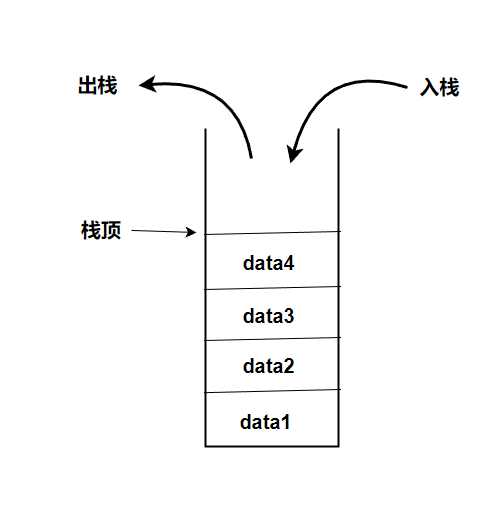
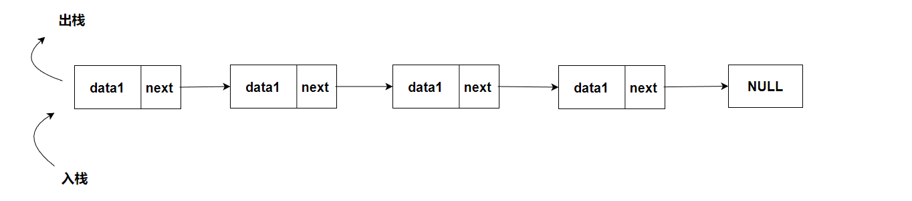
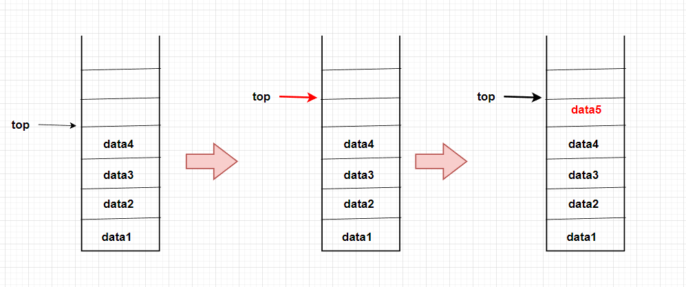
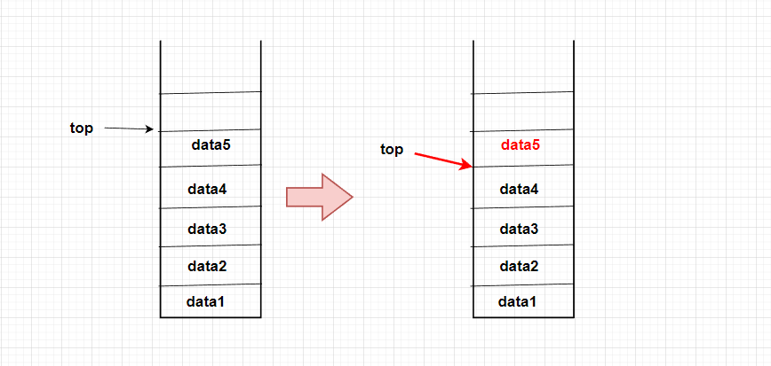
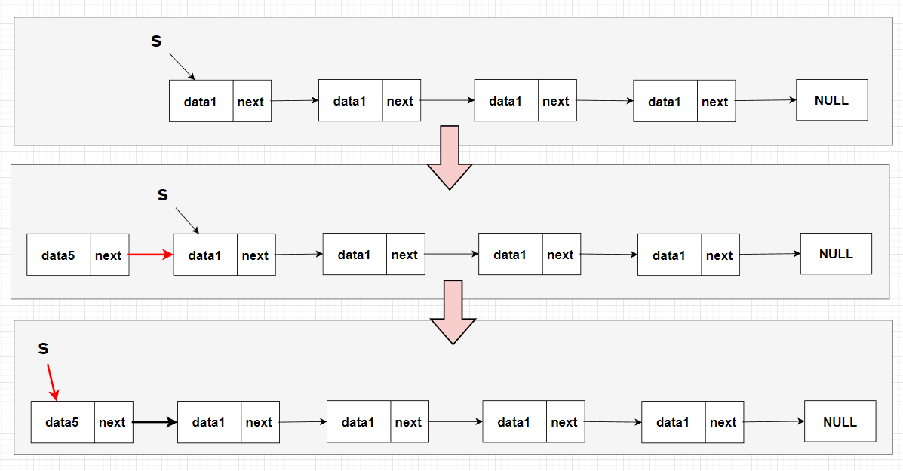
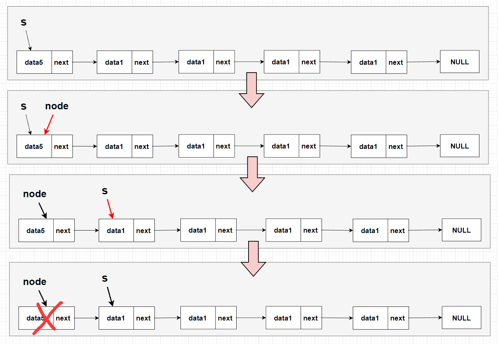

# 【数据结构】C语言实现栈

## 一、栈的定义

栈是一种特殊的线性表，栈只能在一端进行插入和删除，这也意味着当想要获取下面的元素，必须先将前面的元素取出，这个特性叫做 “先进后出”(FILO)，也有人叫 “后进先出”（LIFO），表达都是一种意思。在下图中，当要得到 `data2` 就必须要先把 `data3` 和 `data4` 先取出来，不然无法得到 `data2`



栈有两种实现方式：
1. 使用**顺序存储方式**实现的栈被称为顺序栈，顺序栈存储在一片连续的内存中，这是不是很熟悉，顺序表也是存储在连续内存中的，是的，顺序栈可以看做是只能使用尾插法和尾删法的顺序表，顺序栈通过栈顶判断栈满或栈空
    - 为什么是尾插法和尾删法，而不是头删法和头插法？因为顺序表的头插法和头删法，要移动后面的元素，这很麻烦，而尾删法和尾插法则不需要

    

2. 使用**链式存储方式**实现的栈被称为链栈，链栈不需要存储在连续的空间内，链栈通过节点的 `next` 访问后面的节点，这和链表是一样的，链栈也是可以看做时只能使用头插法和头删法的链表
    - 为什么时头插法和头删法呢？因为尾插法和尾删法需要移动到链表的最后，而头插法和头删法不需要
    - 那使用循环双链表不就可以知道尾节点了吗？可是如果使用循环双链表会浪费很多空间，这相当于只有第一个节点的前向指针有用，后续其他节点的前向指针根本不会被使用到，这会浪费很多空间。

    


## 二、顺序结构的栈

### 0. 定义
顺序栈与顺序表的定义差不多，数据依旧是存储在 `data` 数组中，但不在 `len` 表示数组的长度而是用 `top` 表示栈顶，栈顶是当前最后一个元素的位置，当 `top` 值为 `MAXSIZE - 1` 的位置时表示栈已经满了，当 `top` 的值为 `-1` 表示栈中没有数据。

`status` 用作返回类型，返回值为 `EXIT_SUCCESS` 表示运行成功， `EXIT_FAILURE` 表示运行遇到错误。

```c
#include<stdio.h>
#include<stdlib.h>
#define MAXSIZE 10
typedef int status;


// 栈的定义
typedef struct stack
{
    int data[MAXSIZE];
    int top;
}stack;
```

### 1. 初始化

初始栈中并没有数据，所以将栈顶指向 `-1`；数组通过下标访问，第一个下标为0，所以指向 `-1` 可以表示栈中并没有数据

```c
status Init(Stack* s)
{
    s->top = -1;
    return EXIT_SUCCESS;
}
```

### 2. 入栈

在前面提到过顺序栈的的插入使用尾插法，入栈就是通过尾插法插入数据，但在插入前需要将栈顶加一。

为什么是插入之前栈顶加一，而不是在插入之后再加一呢？因为栈顶是最后一个元素的位置，那么加一后就是要插入的位置，可以直接插入数据，如果将这两个步骤交换会变得很别扭。

`s->top += 1; s->data[s->top] = data;` 这两句可以合为一句：`s->data[++s->top] = data;`，前置 `++` 是先增加再使用



```c
status push(Stack* s, int data)
{
    if (s->top >= MAXSIZE - 1)
    {
        return EXIT_FAILURE;
    }

    s->top += 1;
    s->data[s->top] = data;
    
    return EXIT_SUCCESS;
}
```

### 3. 出栈

出栈使用尾插法，先获取最后的元素，再将栈顶减一，这两步也是不要弄反顺序。

`*e = s->data[s->top]; s->top -= 1;` 这两句同样可以合成一行：`*e = s->data[s->top--];`，后置 `--` 是先使用再减少再使用

虽然说是删除，但其实并没有真正的删除，只是无法访问删除数据的位置，其实数据还是存在的，只有当下一次有数据入栈时才会将旧数据覆盖




```c
status pop(Stack* s, int* e)
{
    if(s->top == -1)
        return EXIT_FAILURE;
    
    *e = s->data[s->top];
    s->top -= 1;

    return EXIT_SUCCESS;
}
```

### 4. 获取栈顶元素

获取栈顶元素与出栈相似，但不会改变栈顶的位置，只会获取栈顶的元素。出栈操作不修改栈顶就是获取栈顶元素了

```c
status GetTop(Stack* s, int* e)
{
    if(s->top == -1)
        return EXIT_FAILURE;
    else
    {
        *e = s->data[s->top];
        return EXIT_SUCCESS;
    }
}
```

### 5. 判断栈空

前面提到过当栈顶指向栈中最后一个元素，所以当栈顶为 `-1` 时，表示栈空

```c
int isEmpty(Stack* s)
{
    if(s->top == -1)
        return 1;
    else
        return 0;
}
```

## 三、链式结构的栈

### 0. 定义

链栈与单链表一样是可以带头结点的，但在本文我使用的是不带头结点的链栈，带头结点的链栈可以自己尝试完成

```c
#pragma once
#include<stdio.h>
#include<stdlib.h>

typedef int status;

// 栈的定义
typedef struct StackNode
{
    int data;
    struct StackNode* next;
}StackNode, *StackList;

```

### 1. 初始化

初始链栈中并不存在节点，所以将链栈指向 `NULL`

```c
StackList Init(StackList s)
{
    StackList s = NULL;
    return s;
}
```

### 2. 入栈

链栈的入栈操作，就是链表的头插法，创建新节点将新节点的 `next` 指向当前的链栈，最后将链栈指向新建的节点，这样就完成了链栈的入栈操作。

有人可能就会问了，顺序栈有栈顶链栈就没有栈顶吗？有的，我们可以将链栈的指向当做栈顶，当链栈中没有节点时，链栈指向 `NULL`，而当有节点时，链栈会指向第一个节点，使用头插法时，第一个节点永远都是最后插入的，栈顶指向最后一个元素的位置，那么就可以说链栈指向的位置就是栈顶



```c
status push(StackList* s, int data)
{
    StackNode* node = (StackNode*)malloc(sizeof(StackNode));
    if (node == NULL)
        return EXIT_FAILURE;
    
    node->data = data;
    node->next = *s;
    *s = node;

    return EXIT_SUCCESS;
}
```

### 3. 出栈

出栈操作就是将链栈中第一个节点删除，先创建一个指向第一个节点的指针，再将链栈指向第二个节点，最后删除第一个节点



```c
status pop(StackList* s, int* e)
{
    if (*s == NULL)
        return EXIT_FAILURE;
    
    *e = (*s)->data;
    StackNode* node = *s;
    *s = (*s)->next;
    free(node);

    return EXIT_SUCCESS;
}
```

### 4. 获取栈顶元素

因为只需要获取栈顶的数据，所以直接访问 `data` 就可以了

```c
status GetTop(StackList* s, int* e)
{
    if (*s == NULL)
        return EXIT_FAILURE;
    
    *e = (*s)->data;

    return EXIT_SUCCESS;
}
```

### 5. 判断栈空

前面说过当链栈指向 `NULL` 时表示链栈为空，所以指向要判断链栈是否指向 `NULL`

```c
int isEmpty(StackList* s)
{
    if(*s == NULL)
        return 1;
    else
        return 0;
}
```